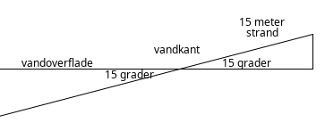
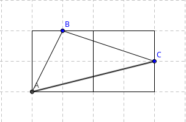

Carstensen og Frandsen Systime Matematik A, 2002
----------------------------------------------
Alle nedenstående opgaver skal løses uden andre hjælpemidler end nedenstående tabel og din hjerne.
Alle resultater skal angives med 1 decimals nøjagtighed - oprundet - og beregnes ved at finde den nærmeste værdi i tabellen.
Besvarelse består af matematisk opstilling og beregning.

Tabel, med 2 decimalers nøjagtighed - oprundet , for vinkler og deres sinus, cosinus og tangens værdier

| Vinkel | 0° | 15°   | 30°    | 45°       | 60°     | 65°   |
|--------|----|------|---------|---------|-----------|-------|
| Sinus  | 0  | 0,26 | 0,50    | 0,71    | 0,87      | 0,91  |
| Cosinus| 1  | 0,96 | 0,87    | 0,71    | 0,5       | 0,42  |
| Tangens| 0  | 0,27 | 0,58    | 1       | 1,73      | 2,14  |

-----------------------------------------------

## Opgave 829
To linjer har hældningskoefficienterne 1 og 2. Bestem den spidse vinkel mellem de to linjer.

## Opgave 830
En linje går igennem ((1,3)) og danner en vinkel på 40° med x-aksen. Bestem linjens ligning.

## Opgave 832
En retvinklet trekant har en vinkel C på 90°. Desuden er a = 4 og b = 9.
Beregn siden c samt A og B.

## Opgave 837 (( modificeret ))
Ved ebbe er en strand 15 meter bred, se tegning 
Når vandet stiger med en hastighed på 0,5 meter i timen, hvor lang tid tager det så, før vandet når 10 meter op på stranden? Antag at stranden har en jævn hældning på 15° i forhold til vandets overflade.

## Opgave 852
Beregn vinklerne i trekanten ABC, se tegning.  
Overvej også er det muligt at finde en løsningsmetode hvor man kan anvende cosinusrelationerne?  
Overvej også - hvilken metode der nemmest at anvende her?

## Opgave 854
Et rektangel er tre gange så langt som det er bredt. Bestem de vinkler, som diagonalerne danner med siderne samt den spidse vinkel mellem diagonalerne.

---------------------------------------------------

## Opgave 856
Man ønsker at konstruere en regulær 10-kant med kantlængden 8 cm. Find radius af den omskrevne cirkel.

## Opgave 2001
Beregn vinklerne i en trekant når siderne er: a = 5, b = 6 og c = 9.

## Opgave 871 (( modificeret ))
Beregn arealet af et cirkeludsnit når korden er 26 cm og radius er 50 cm.

## Opgave 878 (( modificeret ))
To retlinjede veje fører fra et vejkryds i Blommehus til de to byer Æbleby og Pæreby. Afstandene til de to byer er 18 km og 24 km, og vinklen mellem vejene er 60°. Hvor langt er der fra Æbleby til Pæreby?

## Opgave ???

## Opgave ???
